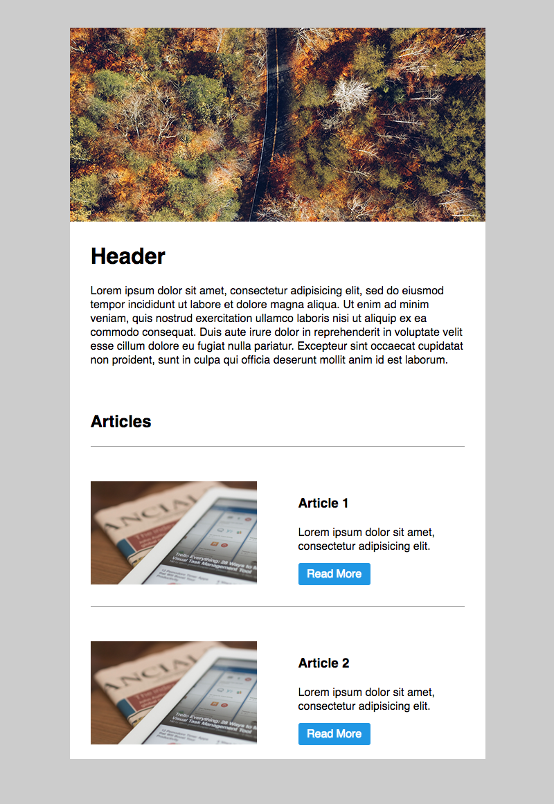

# HEML Email Templates

This project provides several examples of emails built using HEML.

## Installing HEML

You can follow the guide to install HEML [here](https://heml.io/docs/getting-started/usage)

```
npm install heml
```

Build the email from the HEML file using

```
heml build email.heml
```

## Templates

### Top Heavy


